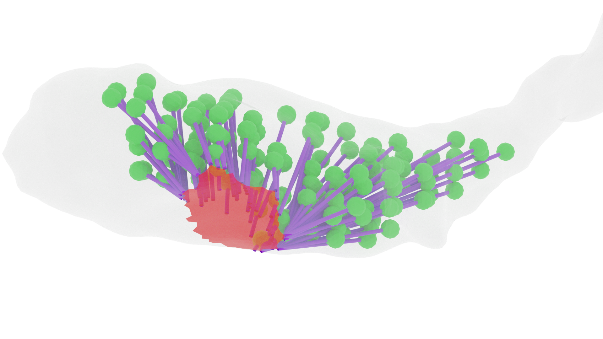

  

# Transition of the presynaptic vesicle cluster from a compact to dispersed organization during long-term potentiation
[DOI:]()

Welcome to the repository for the manuscript titled "Transition of the presynaptic vesicle cluster from a compact to dispersed organization during long-term potentiation". This repository contains all the code created for this publication, for the analysis of the 3D reconstructions and figures in the paper. Additional materials, such as electron microscopy images, 2D traces, and 3D reconstructions in Blender, are available [here](). 

The `/data/` folder contains a table of all measurements taken from the 3D reconstructions. In the `/scripts_blender/` folder, you will find all the scripts created for analyzing the meshes. You can find the code used to generate the figures in the `/script_figures/` folder.  

# Acknowledging the use of this material

Please cite the following paper:

[Garcia, G. C., Bartol, T. M., Kirk, L. M., Badala, P., Harris, K. M., and Sejnowski, T. J. (2026). Transition of the presynaptic vesicle cluster from a compact to dispersed organization during long-term potentiation. PNAS](https://doi.org/10.1002/cne.25254)
